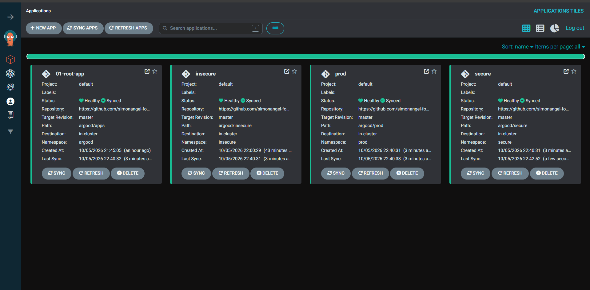

# reat2shell: kind cluster

[Back](../README.md)

- [reat2shell: kind cluster](#reat2shell-kind-cluster)
  - [Steps](#steps)
  - [Create kind](#create-kind)
  - [GitOps with Argo CD](#gitops-with-argo-cd)
      - [Debug Argo CD](#debug-argo-cd)
  - [Create secret](#create-secret)

---

## Steps

| #   | Steps               | Milestone                            |
| --- | ------------------- | ------------------------------------ |
| 1   | create kind cluster | kind cluster runs                    |
| 2   | gitops              | argocd app-of-apps                   |
| 3   | create manifests    | k8s resources created in insecure ns |

---

## Create kind

```sh
# Create the cluster
kind create cluster --config kind/kind-config.yaml
# Creating cluster "react2shell-eks" ...
#  • Ensuring node image (kindest/node:v1.35.0) 🖼  ...
#  ✓ Ensuring node image (kindest/node:v1.35.0) 🖼
#  • Preparing nodes 📦 📦   ...
#  ✓ Preparing nodes 📦 📦
#  • Writing configuration 📜  ...
#  ✓ Writing configuration 📜
#  • Starting control-plane 🕹️  ...
#  ✓ Starting control-plane 🕹️
#  • Installing CNI 🔌  ...
#  ✓ Installing CNI 🔌
#  • Installing StorageClass 💾  ...
#  ✓ Installing StorageClass 💾
#  • Joining worker nodes 🚜  ...
#  ✓ Joining worker nodes 🚜
# Set kubectl context to "kind-react2shell-eks"
# You can now use your cluster with:

# kubectl cluster-info --context kind-react2shell-eks

# Thanks for using kind! 😊

kind export kubeconfig --name react2shell-eks

# Verify
kubectl get nodes -o wide
# NAME                            STATUS   ROLES           AGE   VERSION   INTERNAL-IP   EXTERNAL-IP   OS-IMAGE                         KERNEL-VERSION                      CONTAINER-RUNTIME
# react2shell-eks-control-plane   Ready    control-plane   63s   v1.35.0   172.19.0.2    <none>        Debian GNU/Linux 12 (bookworm)   6.18.33.2-microsoft-standard-WSL2   containerd://2.2.0
# react2shell-eks-worker          Ready    <none>          43s   v1.35.0   172.19.0.3    <none>        Debian GNU/Linux 12 (bookworm)   6.18.33.2-microsoft-standard-WSL2   containerd://2.2.0

kubectl get pods -A
# NAMESPACE            NAME                                                    READY   STATUS    RESTARTS   AGE
# kube-system          coredns-7d764666f9-s9dzf                                1/1     Running   0          89s
# kube-system          coredns-7d764666f9-xsmwx                                1/1     Running   0          89s
# kube-system          etcd-react2shell-eks-control-plane                      1/1     Running   0          97s
# kube-system          kindnet-gw2fc                                           1/1     Running   0          88s
# kube-system          kindnet-np5h2                                           1/1     Running   0          78s
# kube-system          kube-apiserver-react2shell-eks-control-plane            1/1     Running   0          97s
# kube-system          kube-controller-manager-react2shell-eks-control-plane   1/1     Running   0          97s
# kube-system          kube-proxy-hq2dx                                        1/1     Running   0          89s
# kube-system          kube-proxy-xd5qv                                        1/1     Running   0          78s
# kube-system          kube-scheduler-react2shell-eks-control-plane            1/1     Running   0          97s
# local-path-storage   local-path-provisioner-67b8995b4b-lhctt                 1/1     Running   0          85s

# clean up
# kind delete cluster --name react2shell-eks
```

---

## GitOps with Argo CD

GitOps via Argo CD, app-of-apps.

```txt
argocd/
  root-app.yaml                    # app-of-apps root (apply by hand)
  apps/insecure.yaml               # child Application
  inseure/                         # the vulnerable app (sa, deployment, service, secret)
```

```sh
# ##############################
# install argocd
# ##############################
helm repo add argo https://argoproj.github.io/argo-helm
helm repo update argo
# Hang tight while we grab the latest from your chart repositories...
# ...Successfully got an update from the "argo" chart repository
# Update Complete. ⎈Happy Helming!⎈

# install argocd
helm install argocd argo/argo-cd --namespace argocd --create-namespace

# get pwd
kubectl -n argocd get secret argocd-initial-admin-secret -o jsonpath="{.data.password}" | base64 --decode; echo
# port forward
kubectl port-forward service/argocd-server -n argocd 8000:443

# ##############################
# deploy app-of-apps
# ##############################
git add argocd
git commit -m "argocd: app-of-apps + react2shell manifests"
git push

kubectl apply -n argocd -f argocd/root-app.yaml

# Verify
kubectl -n argocd get applications
kubectl -n argocd get secret argocd-initial-admin-secret \
  -o jsonpath='{.data.password}' | base64 -d; echo
```

- argo cd



---

#### Debug Argo CD

```sh
kubectl patch application falco -n argocd --type merge -p '{"metadata":{"finalizers":null}}'

```

## Create secret

| Secret           | Level     | Type    | Namespace | Value                                | Description                     |
| ---------------- | --------- | ------- | --------- | ------------------------------------ | ------------------------------- |
| container-secret | container | generic | insecure  | password="CoNtAinEr-sEcRet-SecURe"   | mounted on insecure pod in ENV; |
| container-secret | container | generic | secure    | password="CoNtAinEr-sEcRet-InsECurE" | mounted on secure pod in ENV;   |
| cluster-secret   | cluster   | generic | prod      | password="cLuSTer-SecReT"            | secret in different ns;         |

```sh
# confirm
kubectl get secret -A | grep -E '(container|cluster)-secret'
# insecure      container-secret               Opaque                          1      25m
# prod          cluster-secret                 Opaque                          1      5m39s
# secure        container-secret               Opaque                          1      3m20s


# confirm the pod-tier secret
kubectl -n insecure exec deploy/react2shell-insecure -- printenv CONTAINER_SECRET
# CoNtAinEr-sEcRet-InsECurE
```

---
