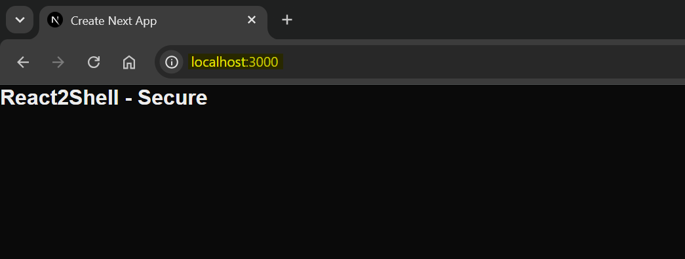

# reat2shell: harden codes

[Back](../README.md)

- [reat2shell: harden codes](#reat2shell-harden-codes)
  - [harden codes](#harden-codes)
  - [Steps](#steps)
  - [React fix](#react-fix)
    - [existing vulnerable app](#existing-vulnerable-app)
    - [Bump upgrade release](#bump-upgrade-release)
    - [Run app](#run-app)
    - [Try exploit vulnerability](#try-exploit-vulnerability)
  - [Dockerfile fix](#dockerfile-fix)
  - [Static analysis](#static-analysis)

---

## harden codes

targets:

- react codes — patch the CVE (unauthenticated RCE in React Server Components)
- Dockerfile — minimal, non-root, no vulnerable build tooling in the runtime

---

## Steps

| #   | Steps          | Milestone                                        |
| --- | -------------- | ------------------------------------------------ |
| 1   | React fix      | exploit returns 404; `npm audit` clean           |
| 2   | Dockerfile fix | non-root, slim image; image scan passes the gate |
| 3   | Trivy scan     | scan pass                                        |

---

## React fix

### existing vulnerable app

```sh
# init next.js
mkdir ./app/react2shell-secure
npx create-next-app@latest ./app/react2shell-secure --js --app --src-dir --no-tailwind --no-eslint

# existing vulnerable version
npm install --prefix ./app/react2shell-secure next@15.2.2
```

---

### Bump upgrade release

- bump `next` to a patched 15.2 release; clear transitive deps.

```sh
cd app/react2shell-secure
# bump to 15.2.9
npm install next@15.2.9

# scans and installs updates
npm audit fix

npm audit
# found 0 vulnerabilities
```

---

### Run app

- run app

```sh
# run app
npm run dev
```



---

### Try exploit vulnerability

```sh
python ./scripts/rce.py http://localhost:3000 calc
# status code: 404
# response text:
# Server action not found.
# executable response:
```

---

## Dockerfile fix

Secure dockerfile:

| Issue                | Misconfig         | Fix                                          |
| -------------------- | ----------------- | -------------------------------------------- |
| CVE-2025-55182       | next@15.2.2       | next@15.2.9                                  |
| curl/jq/dev tooling  | installed package | distroless image                             |
| OS attack surface    | base image        | multi-stage build to minimize attack surface |
| privilege escalation | run as root user  | runs as non-root                             |

- Image size:
  - ~1.3GB -> ~245MB

```sh
# ##############################
# build and run
# ##############################
docker build -f app/Dockerfile.secure -t react2shell:secure app

# runs as non-root
docker run --rm -d --name react2shell-secure -p 3000:3000 react2shell:secure

# ##############################
# try exploit
# ##############################
# try sh
docker exec -it react2shell-secure sh
# OCI runtime exec failed: exec failed: unable to start container process: exec: "sh": executable file not found in $PATH
docker exec -it react2shell-secure bash
# OCI runtime exec failed: exec failed: unable to start container process: exec: "bash": executable file not found in $PATH

docker exec -it react2shell-secure id
# OCI runtime exec failed: exec failed: unable to start container process: exec: "id": executable file not found in $PATH

python scripts/rce.py http://localhost:3000 id
# status code: 404
# response text:
# Server action not found.
# executable response:

# clean up
docker rm -f react2shell-secure
# react2shell-secure
```

---

## Static analysis

```sh
# scan image
trivy image --scanners vuln --severity HIGH,CRITICAL --ignore-unfixed  --ignorefile app/.trivyignore --exit-code 1 react2shell:secure
# Report Summary
# ┌───────────────────────────────────────────────────────────────────────────┬──────────┬─────────────────┐
# │                                  Target                                   │   Type   │ Vulnerabilities │
# ├───────────────────────────────────────────────────────────────────────────┼──────────┼─────────────────┤
# │ react2shell:secure (debian 12.13)                                         │  debian  │        0        │
# ├───────────────────────────────────────────────────────────────────────────┼──────────┼─────────────────┤
# │ app/node_modules/@emnapi/runtime/package.json                             │ node-pkg │        0        │
# ├───────────────────────────────────────────────────────────────────────────┼──────────┼─────────────────┤
# │ app/node_modules/@img/colour/package.json                                 │ node-pkg │        0        │
# ├───────────────────────────────────────────────────────────────────────────┼──────────┼─────────────────┤
# │ app/node_modules/@img/sharp-libvips-linux-x64/package.json                │ node-pkg │        0        │
# ├───────────────────────────────────────────────────────────────────────────┼──────────┼─────────────────┤
# │ app/node_modules/@img/sharp-linux-x64/package.json                        │ node-pkg │        0        │
# ├───────────────────────────────────────────────────────────────────────────┼──────────┼─────────────────┤
# │ app/node_modules/@img/sharp-wasm32/package.json                           │ node-pkg │        0        │
# ├───────────────────────────────────────────────────────────────────────────┼──────────┼─────────────────┤
# │ app/node_modules/@img/sharp-win32-x64/package.json                        │ node-pkg │        0        │
# ├───────────────────────────────────────────────────────────────────────────┼──────────┼─────────────────┤
# │ app/node_modules/@next/env/package.json                                   │ node-pkg │        0        │
# ├───────────────────────────────────────────────────────────────────────────┼──────────┼─────────────────┤
# │ app/node_modules/@swc/helpers/package.json                                │ node-pkg │        0        │
# ├───────────────────────────────────────────────────────────────────────────┼──────────┼─────────────────┤
# │ app/node_modules/caniuse-lite/package.json                                │ node-pkg │        0        │
# ├───────────────────────────────────────────────────────────────────────────┼──────────┼─────────────────┤
# │ app/node_modules/client-only/package.json                                 │ node-pkg │        0        │
# ├───────────────────────────────────────────────────────────────────────────┼──────────┼─────────────────┤
# │ app/node_modules/detect-libc/package.json                                 │ node-pkg │        0        │
# ├───────────────────────────────────────────────────────────────────────────┼──────────┼─────────────────┤
# │ app/node_modules/nanoid/package.json                                      │ node-pkg │        0        │
# ├───────────────────────────────────────────────────────────────────────────┼──────────┼─────────────────┤
# │ app/node_modules/next/dist/compiled/@edge-runtime/cookies/package.json    │ node-pkg │        0        │
# ├───────────────────────────────────────────────────────────────────────────┼──────────┼─────────────────┤
# │ app/node_modules/next/dist/compiled/@edge-runtime/ponyfill/package.json   │ node-pkg │        0        │
# ├───────────────────────────────────────────────────────────────────────────┼──────────┼─────────────────┤
# │ app/node_modules/next/dist/compiled/@edge-runtime/primitives/package.json │ node-pkg │        0        │
# ├───────────────────────────────────────────────────────────────────────────┼──────────┼─────────────────┤
# │ app/node_modules/next/dist/compiled/react-is/package.json                 │ node-pkg │        0        │
# ├───────────────────────────────────────────────────────────────────────────┼──────────┼─────────────────┤
# │ app/node_modules/next/dist/compiled/react-refresh/package.json            │ node-pkg │        0        │
# ├───────────────────────────────────────────────────────────────────────────┼──────────┼─────────────────┤
# │ app/node_modules/next/dist/compiled/regenerator-runtime/package.json      │ node-pkg │        0        │
# ├───────────────────────────────────────────────────────────────────────────┼──────────┼─────────────────┤
# │ app/node_modules/next/package.json                                        │ node-pkg │        0        │
# ├───────────────────────────────────────────────────────────────────────────┼──────────┼─────────────────┤
# │ app/node_modules/picocolors/package.json                                  │ node-pkg │        0        │
# ├───────────────────────────────────────────────────────────────────────────┼──────────┼─────────────────┤
# │ app/node_modules/postcss/package.json                                     │ node-pkg │        0        │
# ├───────────────────────────────────────────────────────────────────────────┼──────────┼─────────────────┤
# │ app/node_modules/react-dom/package.json                                   │ node-pkg │        0        │
# ├───────────────────────────────────────────────────────────────────────────┼──────────┼─────────────────┤
# │ app/node_modules/react/package.json                                       │ node-pkg │        0        │
# ├───────────────────────────────────────────────────────────────────────────┼──────────┼─────────────────┤
# │ app/node_modules/semver/package.json                                      │ node-pkg │        0        │
# ├───────────────────────────────────────────────────────────────────────────┼──────────┼─────────────────┤
# │ app/node_modules/sharp/package.json                                       │ node-pkg │        0        │
# ├───────────────────────────────────────────────────────────────────────────┼──────────┼─────────────────┤
# │ app/node_modules/source-map-js/package.json                               │ node-pkg │        0        │
# ├───────────────────────────────────────────────────────────────────────────┼──────────┼─────────────────┤
# │ app/node_modules/styled-jsx/package.json                                  │ node-pkg │        0        │
# ├───────────────────────────────────────────────────────────────────────────┼──────────┼─────────────────┤
# │ app/package.json                                                          │ node-pkg │        0        │
# └───────────────────────────────────────────────────────────────────────────┴──────────┴─────────────────┘
```
